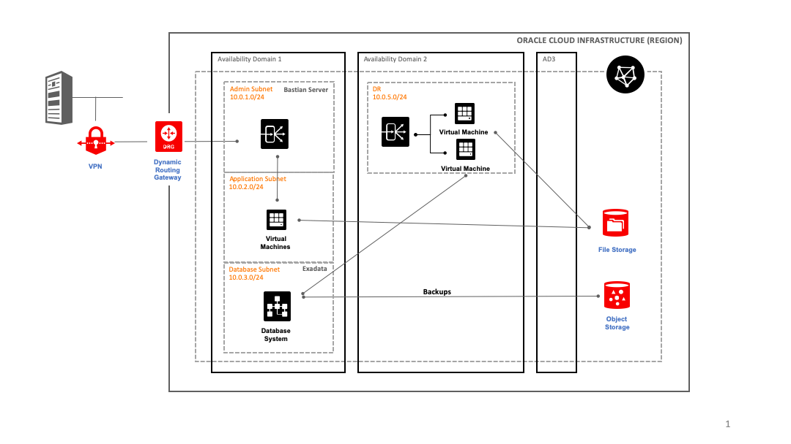

!SLIDE center subsection blue

# Life Before the Cloud

!SLIDE bullets

# On Premise Environment

* Running on 28 servers
* Out of warranty
* Expensive to replace servers

!SLIDE bullets

# Why Move to Hybrid System

* Oracle provided a study on a Hybrid system
* ODA on site for production
  * 28-core system to 16-core system (ODA)
* OCI for non-prod and Disaster Recovery
  * Migrated to OCI 4/1/19
  * Exadata as a Service for Database

!SLIDE bullets

# OCI Benefits

* Cost savings!
* Flexibility in sizing for future projects (9.2 Upgrade)
* Utilize new technology
* Stay on top of hardware upgrades

!SLIDE center subsection blue

# OCI Migration

!SLIDE bullets incremental

# OCI Architecture

1. Leverage OCI technologies
  * Compartments
  * Availability Domains/Fault Domains
  * Block Storage 
  * File Storage (8 Exabytes)
  * Drive Attachments
  * Exadata Cloud Service/Data Guard
1. Follow Cloud Manager Guidelines
  * Admin/Middleware/DB subnets

~~~SECTION:notes~~~
Compartments: We have a non-production compartment for both non-prod and DR. The plan is to create a prod compartment eventually. This let's us completely separate our networks/vms/security.

Drive Attachments: OCI provides a great feature called Consistent Drive Attachments for easy `fstab` entries and for mounting attached storage
~~~ENDSECTION~~~

!SLIDE bullets incremental

# OCI Architecture Design

> How to take these features and design an architecture?

* Separate prod, non-prod & dr via comparments
* Per-comparment
  * Permissions and accesss
  * Virtual Cloud Networks
  * VPN Tunnel

!SLIDE bullets incremental

# OCI Architecture Design

> How to take these features and design an architecture?

        @@@ render-diagram
        graph TD;

          us-asuburn-1-->sSDT:US-ASHBURN-AD-1;
          us-asuburn-1-->sSDT:US-ASHBURN-AD-2;
          us-asuburn-1-->sSDT:US-ASHBURN-AD-3;
          sSDT:US-ASHBURN-AD-1-->AD1-FAULT-DOMAIN1;
          sSDT:US-ASHBURN-AD-1-->AD1-FAULT-DOMAIN2;
          sSDT:US-ASHBURN-AD-1-->AD1-FAULT-DOMAIN3;
          sSDT:US-ASHBURN-AD-2-->AD2-FAULT-DOMAIN1;
          sSDT:US-ASHBURN-AD-2-->AD2-FAULT-DOMAIN2;
          sSDT:US-ASHBURN-AD-2-->AD2-FAULT-DOMAIN3;
          sSDT:US-ASHBURN-AD-3-->AD3-FAULT-DOMAIN1;
          sSDT:US-ASHBURN-AD-3-->AD3-FAULT-DOMAIN2;
          sSDT:US-ASHBURN-AD-3-->AD3-FAULT-DOMAIN3;

* Use Fault Domains for HA
* Availability Domains are for Failover
  * AD's are data centers in close physical proximity 
* Lack of Regional Subnets forced design

~~~SECTION:notes~~~
FD's are different cabinets inside the data center. Good for HA because the network is fast

AD's are distinct data centers in close proximity to each other. High-speed, low-latency connections between ADs exist, but are still slow enough to be a concern for HA. They are better suited for failover (Data Guard, DR, etc)

Lack of regional subnets forced us to pick an AD because our subnet didn't span AD's like the regional subnets do.
~~~ENDSECTION~~~

!SLIDE bullets incremental

# OCI Architecture Design

> How to take these features and design an architecture?

* Utilize block storage mounts for all instances
  * Different backup polices for storage mounts/os mounts
  * Instance replication happens with cloning storage
* File Storage Service
  * No need for a NFS server instance
  * Centralized NFS mounts per-compartment
  * Extremely helpful with the DPK

!SLIDE bullets

# OCI Architecture

!SLIDE bullets

# OCI Architecture

* Storage Mounts
  * `/u01` is a separate block storage attachment
  * `/u01/software` is a file service mount

* DPK 
  * Centralized DPK storage at `/u01/software/dpk`

!SLIDE bullets

# OCI Architecture

* Backups
  * non-prod RMAN backups sent to object storage
  * Block storage policies to back up daily/weekly

* AD Usage
  * Limited to AD1 for Exadata
  * DR and Non-Prod pinned to ADs
  * Works for our hybrid configuration

* DR
  * Data Guard from ODA to Exadata
  * Cron jobs to sync file data

!SLIDE center subsection blue

# Technical Challenges with OCI

!SLIDE bullets incremental

# Challenges

* Some dependencies with IT
  * DNS
  * Email
  * Production Onsite - DR in the cloud
  * Network
* VPN setup or Public IPs
  * need participation with local team
  * Using VPN for OCI communication

!SLIDE bullets incremental

# Challenges

* OCI moves fast
  * no breaking changes, but lots of changes
  * often behind on new features
  * some new features can't be adopted ~without rebuilding~
      * regional subnets
      * Exadata on OEL 7
  * some new features we haven't adopted
      * monitoring and notification
      * security groups (using security lists now)

!SLIDE bullets incremental

# Challenges

* PeopleSoft 9.1
  * No Cloud Manager
  * Everything else works great
* Service Limits
  * Limits per Availability Domain

~~~SECTION:notes~~~
* 9.1 means we can't use CM to auto-deploy, auto-patch our environments
* Service Limits mean we run into issues with our non-regional subnets. We are limited to X machines in a subnet because we are hitting our service limits. They can be moved, but it's not an "elastic" setup.
~~~ENDSECTION~~~

!SLIDE center subsection blue

# Using Terraform

!SLIDE bullets incremental

# Why Terraform

* Infrastructure as Code
* Declarative Syntax
* Works with Version Control
* "Self Documenting"
* Multi-Cloud Support
* Reproducable Intrastructure

~~~SECTION:notes~~~

~~~ENDSECTION~~~

!SLIDE bullets incremental

# Terraform Benefits

* Repeatable Infrastructure Builds
* Dry Run Builds
* Use Existing Resources (import and data sources)
* Provisioner Support
* Build All Resources at Once

~~~SECTION:notes~~~
* You can build your prod/non-prod the same way by changing variables so you get the same infrastructure
* You can run a Terraform Plan to see what changes will be made to your infrastructure before you make the change
* You can import existing resources if they were built by hand
* You can also use existing resources as a data source for new resources being built - Partner Image Catalog, VCN's, etc
* Provisioners let you run commands on the server when they instantiated (good for shorter runs - long runs should be moved off to a script/Resource Manager job)
* Last, you can build all of the resources at once: create an instance, and it's drives, and it's backup policy, in a single run.
~~~ENDSECTION~~~

!SLIDE bullets incremental

# Terraform State

* Terraform maintains a state file
* Reports changes to infrastructure

        @@@
        oci_core_instance.psapp[1] will be created
        oci_core_volume.psapp_storage[1] will be created
        oci_core_volume_attachment.psapp_storage_attachment[1] will be created
        oci_core_volume_backup_policy_assignment.psapp_boot[1] will be created
        oci_core_volume_backup_policy_assignment.psapp_storage[1] will be created
        Plan: 5 to add, 0 to change, 0 to destroy.

!SLIDE bullets

# Terraform Output

* Control what output you see
  * Public/Private IPs
  * Windows Random Password
  * OCID values for new resources

!SLIDE bullets

# Terraform Syntax

        @@@json
        resource "oci_core_instance" "ptupg" {
            count               = "${var.ptupg_count}"
            availability_domain = "sSDT:US-ASHBURN-AD-1"
            fault_domain        = "FAULT-DOMAIN-1"
            compartment_id      = "${var.compartment_ocid}"
            shape               = "VM.Standard2.1"
            display_name        = "ptupg${count.index + 1}"
            hostname_label      = "ptupg${count.index + 1}"
        }

!SLIDE center subsection grey

# Demo

!SLIDE supplemental guide

Tasks: 

* Walk though two modules
* Build a DR server

# Terraform Demo

## Run a Plan for the Network Code

1. Under `network/`

        @@@console
        $ tfp --var-file=nonprod.tfvars
        Plan: 0 to add, 1 to change, 0 to destroy.

1. Don't make changes, but identify that a change was made online that isn't reflected in our code.

## Build a DR server

1. Under `dr/`
1. Change the `var.psapp_count = 2` in `dr.tfvars`
1. Run Terraform Plan to view the changes

        @@@console
        $ tfa --var-file=dr.tfvars
        Plan: 5 to add, 0 to change, 0 to destroy.

1. View the changes in the OCI console
<!-- 1. SSH into the new server -->
1. Change the `var.psapp_count = 1` in `dr.tfvars`
1. Destroy the new resource

        @@@console
        $ tfa --var-file=dr.tfvars
        Plan: 0 to add, 0 to change, 5 to destroy.
